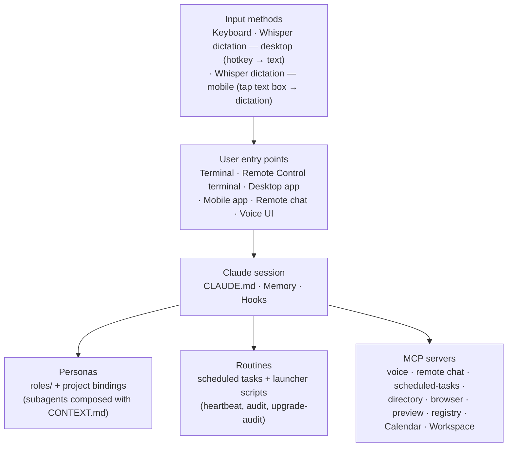
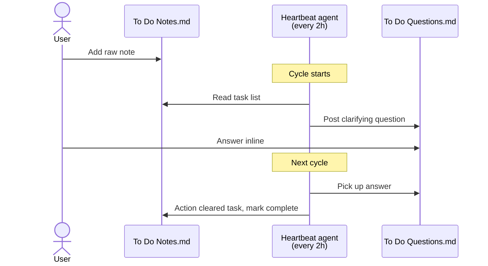

# Agent Workspace — Meta Architecture *(redacted)*

> **Scope:** how a personal **agent workspace** is wired *for the agent*. Personas, routines, hooks, memory, and the coordination layer between them. The worked example runs on Claude Code (so file conventions like `CLAUDE.md` and `.claude/skills/` are Claude-Code-specific), but the architectural patterns port to any agent substrate. **Not** the architecture of any individual project inside it — project application architecture lives alongside each project.
>
> **Audience:** anyone curious about how a practical agent workspace is structured end-to-end, regardless of which agent runtime they use.
>
> **Last updated:** 2026-05-28 — **Repo renamed from `claude-workspace-architecture` to `agent-workspace-architecture`.** Rationale: positioning the patterns against the broader agent ecosystem (Cursor / Cline / Continue / Windsurf / custom Agent-SDK builds) rather than Claude Code specifically. The worked example still runs on Claude Code (file conventions like `CLAUDE.md`, `.claude/skills/`, MCP config stay Claude-Code-specific) — but the architectural patterns port. Old URL 301-redirects. Strategic alignment per the source workspace's brand triangle (book "Agent-First Method" framework + agent-workspace-positioned GitHub flagship + premium contracting). Earlier same day: **Audit-upgrade R1–R9 bundle.** After a researcher-grounded critical assessment of the weekly upgrade-audit tool, nine recommendations landed in one session. The audit moved from "config inspection that occasionally catches problems" to "config + runtime + accuracy-tracked inspection where silent failures become visible." Foundation artefacts: `<workspace>/scripts/security/check_task_freshness.py` (R1 dead-man's-switch — self-hosted alternative to Healthchecks.io, scans `tasks/scheduled-logs/` for missing success-sentinels per task, honours per-task `manual` flag), `<workspace>/scripts/audit_ledger.py` (R3 finding ledger — append-only JSONL with `emit/mark/stats/recent/category-weight` subcommands, drives R6 adaptive sampling), `<workspace>/scripts/audit_cost.py` (R9 cost tracking — parses `upgrade-audit_*.log` for tokens + duration, trends alongside ghost-token baseline), `<workspace>/tests/audit_canaries/` (R4 synthetic canaries — 3 fixtures plus `canary.json` manifest; Phase 0 verifies each canary still detected every run), `<workspace>/.claude/agents/audit-second-opinion.md` (R7 second-opinion auditor — deliberately-different prompt structure, narrative findings, manual quarterly cadence). The primary `audit.md` gained: Phase 0 canary verification, Phase 2.6b runtime health (R2 — closes silent-failure gap by reading actual log artefacts not just config), R5 mechanical-impact tier classification table (replaces text-phrasing heuristic), R6 adaptive source weighting in Phase 2.5b, R8 `[semantic-drift]` category + rotating per-cycle memory grounding in Phase 2.7, R3 ledger-emit step in Phase 3 auto-apply logic, R9 cost-tracking line in Final Output, and a new `## Source material` section at the top citing public patterns (Ford et al. fitness functions, Backstage Soundcheck, OpenSSF Scorecard, Vanta/Drata compliance automation, Healthchecks.io watchdog, ACM 2025 alert-fatigue research, Goodhart's Law on why no numeric audit score, two-auditor pattern, arxiv:2603.10062 memory drift, A-MEM). Full bibliography in [ATTRIBUTION.md § Audit-system patterns](ATTRIBUTION.md). Deliberate non-decision: **no numeric audit score** (Goodhart risk too high for a self-improving audit). Earlier same day: stale-PR cleanup — three dependabot bumps closed via #36, broken `auto-cleanup` workflow deleted entirely via #38 (5 weeks of silent failure on a `**/*.yaml` glob). Previously most recent: **`wrap` skill gains a post-settings-change verification step (step 5b).** Adding or removing a permission/hook only takes effect when a real fire validates it; configuration-shape assumptions ("the pattern looks right") have silently broken scheduled tasks for days at a time (same family as the 2026-04-21 lesson "a scheduled task isn't operational until its logs exist" — see §9 task coordination + the public-mirror's `samples/.claude/skills/wrap/SKILL.md`). The wrap now requires checking the next scheduled-task log for the expected success sentinel before declaring complete — and surfacing the verification as `Needs user confirmation` if no fire will hit the changed surface within ~24h. Encoded as a discrete step between the registry sweep and the memory sweep so it can't be skipped. Same cycle: a weekly upgrade-audit ran and surfaced 13 actionable items (11 new + 2 carried — all actioned same-session, including registering a previously-unregistered project folder in §11, 3 project-binding description rewrites to "Use when…" trigger phrasing for cleaner auto-routing, deleting a stale git branch after PR merge, adding a path-scoped rules file for a finance-data project with bank-code conventions / FY conventions / xlsx write guards, and a comprehensive test suite for the finance-data project's categorisation engine — 62 tests pass in 1.22s). One "missing 2FA" security finding turned out to be registry drift, not real exposure — surfaced the lesson that audit findings derived from a registry can be data-quality drift rather than state, and the registry should be updated to match reality before treating as exposure. Previously most recent: **New security + workflow patterns from a weekly upgrade-audit cycle.** (1) *Third-party command-safety hook* — adopted an open-source plugin (`claude-code-safety-net`, MIT) that adds a PreToolUse Bash hook for semantic destructive-command interception (`git checkout --` / `restore` / `branch -D` / `clean -f` / `find -delete` / `xargs rm -rf` + interpreter wrappers), complementing the in-house bash-safety hook — defense-in-depth. Source-verified before install (one runtime dep, no telemetry; network limited to an opt-in version-check outside the hook path). Loads in the interactive CLI only — a headless/SDK environment has no plugin subsystem, so the in-house hooks remain the floor there (a hook being *configured* is not the same as *loaded in the running session* — verified by live-fire, not status output). See §4/§7. (2) *PreCompact transcript-backup hook* — backs up the transcript before context compaction (pruned to last 5) to guard against compaction loss; see §4. (3) *Audit governance retune* — the weekly audit's services-registry check no longer flags registry-cell incompleteness that merely duplicates the password manager (point-don't-mirror), and no longer flags age-based credential rotation as a standing finding (NIST SP 800-63B — periodic rotation of unique, 2FA-protected, manager-stored credentials isn't a meaningful control); rotation is flagged only on an exposure/compromise trigger. (4) *HTML-deliverable output convention* — generate human-facing deliverables (specs, reports, dashboards) as self-contained HTML when they benefit from visuals/interactivity, but keep Markdown as the source-of-truth for anything the model re-ingests (auto-loaded context, instructions, memory); render HTML as a *view* from the md source. Also: additional project folders (a non-fiction book project + a professional-services workstream) registered in §11. Previously most recent: **OS-level isolation of the heartbeat agent shipped to runnable state (Phases 0–5 + Phase 6 setup complete).** A multi-phase project to containerise a recurring agent landed end-to-end in ~2.5 days focused work spread across a 5-day calendar window. Architecture: heartbeat container on a Docker `internal: true` bridge network (zero internet egress); an `anthropic-proxy` sidecar service straddles that internal network plus a `proxy-egress` network with internet, and forwards `/v1/*` requests to the model API after injecting the real auth header — so the heartbeat container's env never holds a credential, only `MODEL_API_BASE_URL=http://anthropic-proxy:8788` and a placeholder. RO mounts on the workspace + narrow per-file RW on four named coordination files + RW on a `/sandbox` directory for staging. `tini` PID 1 + pinned model-CLI version + BuildKit cache mounts in the Dockerfile. New scripts under `<workspace>/scripts/heartbeat/`: a stdlib-only HTTPS forwarder (~360 LOC, dual-stack IPv6 — Docker Desktop's host-gateway resolves to an IPv6 ULA address from inside containers, so v4-only listeners are silently unreachable), a sandbox walker for credentialed post-cycle operations (`gh pr create` etc., always behind `--apply` + interactive prompt), and an observation-tool that walks scheduled-task logs and reports cycle count + sentinel rate + error count over a configurable window. New container layer at `<workspace>/containers/heartbeat/` (Dockerfile + docker-compose.yml + a pre-flight mount validator that refuses dangerous source paths + boundary probes for filesystem and network). The scheduled-task wrapper was rewritten with a dispatch decision tree — one specific skill name routes through the containerised path with check-mounts pre-flight + stale-container kill + sidecar startup + sentinel detection + post-cycle reviewer; everything else still runs the direct path; a `-FallbackToDirect` switch is retained as emergency escape until the observation window closes. A UTF-8 logging helper (`Invoke-TeeUtf8`) replaced PS 5.1's default `Tee-Object` because the latter writes UTF-16 LE which silently broke a sentinel-detection regex. New rule on the heartbeat-instructions file specifies emission of an explicit `HEARTBEAT_OK` sentinel on idle cycles so the wrapper can suppress downstream notification. New convention: a per-project `OBSERVATION.md` runbook (status line / next action / logbook / step-by-step procedure / rollback conditions) for any long-running observation window, designed so a future session opens the file and knows exactly where the project is. Two new lessons captured: (1) Docker `internal: true` networks block host-gateway routing in addition to NAT, so a host-side proxy on `internal: true` is unreachable — sidecar architecture is the canonical fix; (2) Docker Desktop's host-gateway alias resolves to IPv6 ULA, so local listeners must dual-stack on `::` not `127.0.0.1`. Phase 6 (observation + cutover) is now a 1–2 week user-paced calendar window with explicit entry/exit criteria. Phase 7 (extracting primitives into a reusable container-agent library) is intentionally deferred until a second concrete instance appears. Previously most recent: **Upgrade-audit batch hygiene + five new skills adopted from upstream (obra/superpowers + gstack).** Fifth weekly upgrade-audit cycle batch-actioned. *Config hygiene*: stale one-off permissions purged from workspace-local `settings.local.json`; two disconnected plugins set to `false` in `enabledPlugins` (both failing to connect with no active workflow); an unused MCP server removed; a globally-resolved code-packing tool refreshed to latest via `npx -y <pkg>@latest`. *Hook changes*: PreToolUse Edit/Write hook extended to protect the heartbeat's append-only rejection ADR log; a dead file-pattern check from an archived project removed. *Skill adoption (see §5)*: a checkpoint/restore pair from gstack — `context-save` writes a timestamped session-state snapshot (task, files in flight, decisions, blockers, next action, git state) to `<workspace>/tasks/checkpoints/`; `context-restore` loads the most recent checkpoint (canonical ordering by filename prefix, not mtime) and runs a drift check before resuming. A 30-second composite health dashboard from gstack — `health` runs type-check, lint, test-collection, dead-code, secrets, memory-lint, roles-validator, ghost-token-drift; weighted 0-10 rubric with A-D grade; JSONL trend history at `<workspace>/scripts/_state/health_history.jsonl`; read-only (diagnoses, never fixes). Two workflow primitives from obra/superpowers — `subagent-driven-development` for plan-driven execution (fresh subagent per task + two-stage review: spec compliance then code quality) using `roles/review-templates/spec-reviewer.md` + `code-quality-reviewer.md` for the review stages; `dispatching-parallel-agents` for independent-domain fan-out (single Agent message with multiple tool-use blocks). Three legacy skills pointing at an archived project removed. *Subagent-description rewrites*: heartbeat agent description reflects its classify-then-act flow; audit agent description reflects its 8-phase sweep scope. *Memory index integrity*: launcher-script count and role count refreshed. *Audit source list*: a widely-forked personal skill library added as a new monthly Phase 2.5b source (skills directory only; per-skill portability filter). Previously — **heartbeat-as-PR-agent cutover + security envelope + idle-cycle observations + containerised-heartbeat project scoped.** Same-day cascade of four related changes: (1) heartbeat workflow shifted from *question-then-action* to *classify-then-act* with a durable ADR-style rejection log and a new `review-queue` skill (see below); (2) security envelope — new PreToolUse Bash hook at `<workspace>/scripts/security/check_bash_command.py` closing the Bash-gap in the Edit/Write protection, plus HEARTBEAT.md rules 14–16 (ban pushes to main/master, cap review queue at 10, honour dry-run marker), plus `create_staging.py` slug validation; (3) heartbeat idle-cycle observations phase — new `scripts/heartbeat/idle_observations.py` surfacing local patterns (rejection clusters, stale staging, stale reference memory, review-queue batching opportunities) when the heartbeat has no task-shaped work; (4) containerised-heartbeat project scoped — a new multi-phase initiative to isolate the heartbeat agent at OS level (read-only workspace mount, narrow RW sandbox, credentialed operations via host-side reviewer, egress-filtered network). Currently Phase 0 (design review). Earlier — **heartbeat-as-PR-agent cutover.** The heartbeat's workflow shifted from question-then-action to **classify-then-act** — every new task is classified into `has-default` / `needs-intent` / `out-of-scope` via a new deterministic classifier (`<workspace>/scripts/heartbeat/classify_task.py`); `has-default` tasks are built speculatively in a sandbox (git worktree for git-scope, staging folder otherwise — `create_staging.py` auto-selects), lodged in `<workspace>/tasks/HEARTBEAT_REVIEWS.md` for user review, and on rejection logged to `<workspace>/tasks/HEARTBEAT_REJECTIONS.md` as ADR-style durable memory — heartbeat greps this log before classifying any future task; 3+ rejections on a task force `needs-intent` (circuit breaker, via `check_rejections.py`). A new workspace skill `review-queue` walks the review queue on demand (`/review-queue` — distinct from the built-in `/review` PR plugin). Morning-brief SKILL.md gained a `## Awaiting your review` section so the queue surfaces in the daily newsletter. Shared primitives live under `<workspace>/scripts/heartbeat/` so a future executive-vs-autonomous hybrid in a business project can import the same classifier + sandbox + review-surface + rejection-history building blocks. Earlier — **`ghost_token_counter.py` baseline counter + 4 new Phase 2.5b audit-tracking sources after researcher review of 9 token/context-tooling repos.** New `<workspace>/scripts/ghost_token_counter.py` — stdlib-only (chars/4 approximation) — measures tokens loaded at session start across user + workspace `CLAUDE.md`, always-loaded memory files (excluding `episodes/`), skill + subagent + scheduled-task frontmatter descriptions, and hook command strings. Per-source breakdown logged to a local SQLite file. Wired into the weekly `upgrade-audit` Phase 1 as its first step — a Phase 3 Structural Improvements finding is surfaced if the baseline grows more than 10% above the 4-8 week median. Pattern reference (not dependency): `alexgreensh/token-optimizer`. Same session, the Phase 2.5b audit-tracking list gained four repos after a researcher review of nine candidates: `rtk-ai/rtk` (org-backed Rust CLI proxy that compresses tool output), `tirth8205/code-review-graph` (tree-sitter blast-radius MCP), `mksglu/context-mode` (tool-output sandbox MCP — NOASSERTION license, track patterns only), and `zilliztech/claude-context` (semantic code-search MCP, Zilliz-backed). Five of nine were rejected (single-author + stale / duplicates existing capability / tool-count bloat / license unclear). RTK install itself was deferred pending trigger conditions (rate-limit pain, huge-log codebase, or a future release with signed binaries + opt-in telemetry). Earlier today — **Morning-brief scheduled-task root cause fixed + newsletter HTML rendering + AI news source pool expanded 3→10.** Three intertwined upgrades to the daily brief pipeline: (1) *scheduled firing finally works* — `schtasks /Query` showed every firing had been crashing before producing output (`Last Result: 0xC000013A` = `STATUS_CONTROL_C_EXIT`, `scheduled-logs/` empty). Root cause: `LogonType: Interactive only` + a detached/hidden session has no console handle, so `claude --print` (Node.js) dies on a broken stdio pipe before writing a byte. Fix: Task Scheduler → Properties → "Run whether user is logged on or not" + Windows password (flips principal to `Password`, shown as `Interactive/Background`). Applied across all three live Claude tasks. Same session also registered a `Heartbeat Monitor` Task Scheduler entry — `schtasks /Query` confirmed its SKILL.md had never fired. (2) *Newsletter HTML rendering* — new `scripts/brief_render.py` parses the brief's markdown and emits inline-CSS HTML with a section-aware template (masthead + weather strip + two-column appointments + AI-news cards with source-hostname badges + task sections with count badges + numbered open questions + overnight/attention + footer). Palette: warm off-white body, deep navy primary, burnt-orange accent. System fonts + Georgia serif masthead. Max-width 640px table layout (email-client standard). `send_self_email.py` extended with `--html-file` for multipart text+HTML delivery. Zero new deps. (3) *AI news source pool expanded 3 → 10 feeds* — added OpenAI, Google DeepMind, Google AI Blog, Google Research (provider-official) and MIT Tech Review AI, Wired AI, TechCrunch AI (tech media). **Anthropic has no public RSS** — verified all candidate paths return 404; HN + Simon Willison cover those announcements within hours. Per-source cap of 6 items per run prevents arXiv / HN / TechCrunch from monopolising the pool at small `--limit` values. Selection criteria in the morning-brief SKILL.md refined with explicit quality bar ("major updates, technology breakthroughs, major thought pieces"), provider-official promoted to first priority, expanded skip list (CEO takes, incremental dot-releases, funding chatter unless it reshapes the landscape). Earlier today — **Weekly upgrade-audit agent upgraded with Phase 2.5c: per-section best-practice research + trust-gradient auto-apply.** The weekly audit now fans out one `researcher` subagent per major META_ARCHITECTURE section (roles / skills / subagents / hooks / scheduled tasks / MCP / memory / task coordination) to produce focused best-practice findings. Each finding is classified into three tiers: **Tier 1** (SAFE, auto-applied silently — e.g. a new canonical role, a defensive protection-blocklist addition, Red Flags/Rationalization Table additions); **Tier 2** (AUTO-APPLY + PROMINENT SURFACING — a new workspace skill / subagent / Command Shortcut; the Phase 3 report leads with a `### New capabilities this week` block so the user learns of the new invocation phrase); **Tier 3** (REQUIRES APPROVAL, never auto-applied — new MCP servers, new scheduled tasks, new hooks, removal of any existing safeguard). Rate-limit: at most 5 Tier-1/Tier-2 changes applied per audit run, remainder queued under a new `### Deferred (rate-limit)` block. Safety guardrails: downgrade to Tier 3 if a validator fails or if the target file has a `git log` entry in the last 24 hours; auto-apply disabled entirely if Phase 2.6 finds >3 CRITICAL security findings; auto-apply also disabled if prior two weeks' Tier-2 additions haven't been mentioned in any subsequent user activity (heuristic: the user hasn't noticed the last additions — stop adding). Earlier today — **`terse-mode` skill + AI-news section in the daily brief + archive-split pattern for task-coordination files.** A new `terse-mode` skill at `<workspace>/.claude/skills/terse-mode/SKILL.md` gives a session-long output-compression discipline — drops preambles, trailing summaries, hedges, and restatements — with an Iron Law preserving tool arguments, code, error messages, security warnings, research-brief claim grades, and final deliverable content. Pattern credit: a meme-aesthetic community plugin whose core compression idea was reimplementable as a ~30-line prompt with no dependency. Earlier today — new `<workspace>/scripts/ai_news.py` helper (stdlib-only: `urllib` + `xml.etree` + `sqlite3`, zero pip deps) fetches curated RSS/Atom feeds, filters to the last 48h, dedups via SHA-256 content-hash in a local SQLite store, auto-marks returned items as seen, 30-day prune. The `morning-brief` scheduled task now has a `## AI news` section that picks 3-5 actionable items from the helper's output and skips cleanly when zero items survive dedup — fractional token cost (~2k input + ~300 output per run, tiny relative to the brief's existing calendar + email + bill pipelines). The weekly `upgrade-audit` agent's Phase 2.5b external-opportunities source list gained HN Algolia JSON + two Reddit subreddit RSS feeds for broader community signal (not token-constrained — audit runs weekly). Earlier today — **`orient`-skill context-weight cleanup via two archive splits.** The open task-questions file split into open-blocks-only main file plus a new `<workspace>/tasks/answered/To Do Questions.md` archive (61 blocks → 12 active); older completed-review blocks in `<workspace>/tasks/todo.md` migrated to a new `<workspace>/tasks/todo-archive.md`; this file's own rolling changelog paragraph extracted to a new `<workspace>/CHANGELOG.md` and replaced with a short pointer + today's summary — the paragraph had grown per-session and loaded on every orient. Net reduction to the always-loaded file set: roughly 80k characters. The heartbeat agent's rules file gained a new rule 8: move resolved question blocks to the archive at resolution time rather than leaving them inline. Earlier today — **Public-repo `link-check` GitHub Actions workflow split into two modes.** On `pull_request`: check only the `.md` files actually changed in the diff (via `git diff --name-only --diff-filter=ACMR`). On the weekly cron and `workflow_dispatch`: full-repo sweep, auto-opens an Issue on failure. Rationale: whole-repo checks on every PR made contributors responsible for link rot they hadn't introduced and flooded the maintainer's inbox with failure emails on unrelated PRs. Diff-only scopes PR failure to the author's actual change; the weekly cron catches background rot (stale vendor URLs, dangling internal links after deletions) on a reviewable rhythm. Earlier — **OS-level Whisper dictation now the voice-input path across every Claude surface (desktop + phone + Remote Control); planned voice-channel rebuild retired.** Claude's built-in voice mode (terminal + desktop app) is closed to third-party STT/TTS swaps, so rebuilding a custom voice-channel server would only ever improve one surface. Instead the workspace now leans on an OS-level dictation layer at every surface. On desktop: a Whisper-based dictation tool (e.g. Wispr Flow) — hold a hotkey, speak, transcribed text is typed into whatever field has focus — covers the Claude Code CLI (including Remote Control terminal sessions launched via `remote-control.bat`), the Claude desktop app, Claude web, and any other text input on the machine. On phone: the same tool's native Android app, granted accessibility control, surfaces a dictation icon whenever a text box is tapped — including inside the Claude Android app's prompt field. Net effect: full voice-input coverage on every device the user talks to Claude from (home desktop, remote-controlled desktop session, phone), with zero integration code on the workspace side. The existing `voice-channel` MCP stays operational for its mobile file-upload role (photo drops for the nutrition tracker and receipts inbox); voice I/O on that server is deprioritised. The corresponding "Improved voice integration" entry in §14 Planned future upgrades has been removed. TTS of Claude's replies intentionally left unaddressed — revisit only if hands-free/eyes-free becomes a concrete pain point. Earlier today — **New `Reference/Research/` folder convention for preserved research briefs.** When a `researcher`-role investigation produces a defensible output worth keeping across sessions, it lands in `<workspace>/Reference/Research/` as `YYYY-MM-DD_<topic-slug>.md`. Each brief carries frontmatter (`type: research`, `status`, `last_verified`, `verify_by_checking`, `methodology`, `tags`), leads with answer-first synthesis, and preserves the subagent transcripts as appendices — Iron Law: "no brief without appendices." The folder sits alongside the services registry and email-rules registry as the workspace's "research outbox" (complement to the service inbox and automation rules). Earlier today — **New auto-routed workspace subagent wrapping the `researcher` role.** A workspace-level subagent at `<workspace>/.claude/agents/researcher.md` composes the canonical role via `@`-include; its CSO-style description is picked up by Claude Code's subagent picker so research-shaped tasks (market/competitor scans, technical library comparisons, regulatory/tax research, literature reviews, due diligence, fact-checking) auto-route to `researcher` rather than `general-purpose`. User-global `CLAUDE.md` § Subagent Strategy carries an explicit preference directive for reinforcement. Effective on next session — the `.claude/agents/` directory is scanned at session launch, not hot-reloaded. `requires_context: false` → no project binding required; entity facts are passed inline by the calling agent when needed. Earlier today — **New canonical role: `researcher`.** Evidence-based investigation role added to the library (v1.0.0, category `research`, default model `opus`, tools include `WebSearch`/`WebFetch`/`Agent` for multi-source triangulation). Blends three disciplines: consulting-analyst structure (answer-first, MECE, Pyramid Principle), investigative-journalism fabrication guards (two-source rule, claim-evidence-attribution, no composites), and academic systematic-review rigour (pre-committed inclusion criteria, dissent as data, graded evidence). Core constraints: primary-source preference (statute > commentary, paper > press, changelog > tutorial), compound-attribute verification against fabrication, two-axis Admiralty-style source grading (reliability × claim credibility), every claim tagged `[observed]`/`[inferred]`/`[unverified]`, load-bearing claims quote-then-paraphrase. Intentionally unbound (`requires_context: false`) — invoked directly, not through a project binding. Library count 16 → 17. Earlier — **Scheduled-task firing restored via OS-level scheduler.** A user report (the daily brief never landed in the user's inbox) revealed that the Claude Code app's built-in `scheduled-tasks` MCP was listed in `settings.json` permissions but never actually connected (verified via `claude mcp list` — the server did not appear). Consequence: SKILL.md files under `<home>/.claude/scheduled-tasks/` were not firing on their own. Fix: register OS-level Task Scheduler entries pointing at a thin wrapper (`scripts/run-scheduled-skill.ps1`) that reads the SKILL.md, pipes the content as the prompt to `claude --print --add-dir <workspace>`, and tees all output to a timestamped log in `<workspace>/tasks/scheduled-logs/`. The wrapper uses the Continue error-action preference per the PS 5.1 native-CLI lesson. Workaround until the built-in MCP is available or a future Claude release ships a canonical binding mechanism. Earlier — **Memory architecture hardening.** Split the always-loaded semantic memory from one-off episodic events via a new `episodes/` subfolder (one-off events — cleanups, migrations, launches — move there and are no longer referenced from the `MEMORY.md` index, keeping the always-loaded prefix small). Added `learned_on` / `last_verified` / `verify_by_checking` YAML frontmatter to all `reference_*.md` memory files so drift is surfaceable. New memory-lint script walks memory + episodes and verifies every referenced file path still exists; runtime-created paths (browser-profile dirs, MCP log folders, OAuth state dirs) allowlisted. New weekly `consolidate-memory` scheduled task does the deeper pass — resolves contradictions against source-of-truth docs, converts relative→absolute dates, merges duplicates, moves stale episodes, keeps `MEMORY.md` under its 200-line ceiling. Four-op discipline per fact (ADD / UPDATE / DELETE / NOOP). The heartbeat agent gained a "Memory lint" step in every cycle. User-global `CLAUDE.md` gained a `Memory hygiene` section codifying dedup-on-write, point-don't-mirror, four-op discipline, and Anthropic's verbatim memory-tool hygiene rule. The `wrap` skill now mirrors every `META_ARCHITECTURE` touch to the public redacted copy and pushes — a drift-prevention habit so the public snapshot never falls behind the private source. Earlier — Gmail Automation Stack shipped: new `morning-brief` scheduled task (daily) orchestrates email triage + receipt capture + bill tracking + appointment extraction + local weather brief. Five new Python helpers in `scripts/` (`email_rules.py`, `receipts_pipeline.py`, `bill_tracker.py`, `appointments.py`, `send_self_email.py`) consume an email-rules registry and a services registry. Brief shows appointments for next 14 days + task-list counts + open-questions digest. Delivery: SMTP self-send to the user's own inbox via `send_self_email.py`, with draft fallback. **Narrow Iron Law exception** (2026-04-19): `send_self_email.py` hardcodes recipient as the user's own address and refuses any other; MCP send-email remains ungranted; all other email operations still drafts-only. Earlier same day: inbox cleanup (~25k → 0) across 8 batches; created an email-rules registry (~500 rules, YAML schema, consumer-tagged for bill-monitor/receipt-capture/email-triage/morning-brief/tax-receipts). Earlier same day: added Google Calendar + Google Workspace MCP servers (Calendar full, Gmail readonly, Drive readonly); extended file protection to Google OAuth credentials. 2026-04-18 — extended the services registry into a subscription tracker (new `Next renewal` + `Tax` columns); added a renewals scan to the heartbeat loop. Earlier the same day: added a `developmental-reviser` role + project binding; reorganised a novel project into a new `Books/` group.

## Contents

1. [Layers at a glance](#1-layers-at-a-glance)
2. [Personas — the Roles Library](#2-personas--the-roles-library)
3. [Routines — recurring agents and one-shot launchers](#3-routines--recurring-agents-and-one-shot-launchers)
4. [Hooks — automatic behaviours on events](#4-hooks--automatic-behaviours-on-events)
5. [Skills — invokable capabilities](#5-skills--invokable-capabilities)
6. [Subagents — specialised workers](#6-subagents--specialised-workers)
7. [MCP servers — external capability bridges](#7-mcp-servers--external-capability-bridges)
8. [Memory system — persistent context across sessions](#8-memory-system--persistent-context-across-sessions)
9. [Task coordination layer](#9-task-coordination-layer)
10. [File protection / safety](#10-file-protection--safety)
11. [Project layout](#11-project-layout)
12. [Where things live (quick reference)](#12-where-things-live-quick-reference)
13. [Source attribution — patterns this workspace draws on](#13-source-attribution--patterns-this-workspace-draws-on)
14. [Maintenance](#14-maintenance)
15. [Planned future upgrades](#15-planned-future-upgrades)

Companion docs: [ADOPTION.md](ADOPTION.md) — 5-step walkthrough for setting up a similar workspace · [samples/](samples/) — scaffold files illustrating each layer.

## Conventions

- **`<workspace>`** / **`<home>`** / **`<project>`** are placeholders; substitute your own paths.
- Type markers in tables:
  - **[stock]** — ships with Claude Code out of the box
  - **[plugin]** — installed via a plugin
  - **[local]** — local external install (npm global, uvx, standalone binary)
  - **[custom]** — written for this workspace

---

## 1. Layers at a glance



Input methods layer above entry points: text typed into any surface (terminal, Remote Control terminal, desktop app, mobile app, remote chat, voice UI) can come from a keyboard or from an OS-level Whisper dictation layer. The same dictation tool runs on both desktop (hotkey → text into focused field) and phone (tap any text box → dictation icon), so voice input is available everywhere the user talks to Claude without any workspace-side integration. Six surfaces sit above the Claude session (entry points), three sit below (personas, routines, MCP). Each section from §2 onward details one slice.

---

## 2. Personas — the Roles Library

> See also: [Claude Code subagents documentation](https://docs.claude.com/en/docs/claude-code/sub-agents).

**Library:** `<workspace>/roles/` — 17 pure, reusable canonical role definitions, each with a fixed schema (frontmatter + Identity / Directives / Constraints / Method / Output format / Red Flags / Rationalization Table).

**Canonical roles (17):** `accountant`, `backend-developer`, `bookkeeper`, `data-engineer`, `developmental-editor`, `developmental-reviser`, `frontend-developer`, `health-data-analyst`, `learning-strategist`, `llm-engineer`, `nutritionist`, `platform-engineer`, `product-thinker`, `researcher`, `security-auditor`, `tester`, `wealth-manager`.

**Composition:** each project has thin subagent bindings under `.claude/agents/` that compose a canonical role with the project's `CONTEXT.md` (entity facts) via `@` includes.

**Rule:** roles are pure (no entity facts). Entity facts live in each project's `CONTEXT.md`.

```mermaid
flowchart LR
    role["Canonical role<br/>roles/security-auditor.md<br/>(pure, no entity facts)"]
    ctx["Project CONTEXT.md<br/>(entity facts: stack, paths, decisions)"]
    binding["Thin binding<br/>project/.claude/agents/<br/>project-security.md<br/>(role + CONTEXT via @ includes)"]
    call["@project-security<br/>invocable subagent"]
    role --> binding
    ctx --> binding
    binding --> call
```

**Validation:** a roles validator script checks frontmatter schema + binding composition. Runs every heartbeat cycle; exit non-zero surfaces a question.

| Project type | Bindings (illustrative) | Context source |
|---|---|---|
| Personal finance | accountant / wealth-manager / bookkeeper | project `CONTEXT.md` |
| Software product | backend / frontend / tester / security / llm / product | project `CONTEXT.md` |
| Personal health | health-analyst / nutritionist | project context file |
| Creative writing | developmental-editor / developmental-reviser | project `CONTEXT.md` |
| Education | learning-strategist | project `CONTEXT.md` |

**Not yet bound to any project:** `data-engineer`, `platform-engineer`, `researcher`. The `researcher` role is intentionally unbound — it's domain-agnostic (`requires_context: false`) and invoked directly for evidence-based investigation on any topic.

**See also:** a `roles/README.md` with the schema and binding quick-reference; a `roles/_template.md` for new roles. A filled-in example lives at [`samples/roles/security-auditor.md`](samples/roles/security-auditor.md) (one of 17 canonical roles shipped in `samples/roles/`).

---

## 3. Routines — recurring agents and one-shot launchers

### Entry points — Claude Code app

Previously the workspace was driven from a handful of terminal windows, each one launched by a `.bat` script and holding its own Claude session. The Claude Code desktop app now unifies that surface:

- **Routines** — the app's built-in scheduler — replace most launcher `.bat` files for recurring work. Terminal launchers are retained only for flows that need specific env-var hygiene or direct shell control.
- **Persistent parallel sessions** are the main win. The app holds many independent sessions open side-by-side, each anchored to a different workstream; the user actions whichever is ready. At the time of writing: 9 sessions cycled through earlier the same day, with ~50 agents and subagents running concurrently across them — each a different thread (bug fix, document edit, research query, project scaffold).

Net effect: less context-swap tax. Each thread stays warm; the user returns to it when it's useful rather than reconstructing state every time.

### Launcher scripts (`<workspace>/scripts/`)

All entries below are **[custom]**.

| Script | Purpose |
|---|---|
| `launch-claude.bat` | Bootstrap launcher with CLAUDE.md sanity check across all project folders. Primary entry point for terminal sessions. Delegates to `_bootstrap-check.bat`. |
| `_bootstrap-check.bat` | Shared subroutine. Scans project folders for missing CLAUDE.md files and offers to create stubs. Called by the other launchers. |
| `remote-control.bat` | Starts a Claude session with Remote Control enabled. Bootstrap check + interactive session. Must be double-clicked — cannot be invoked from within Claude Code (env inheritance issue). |
| `voice-channel.bat` | Kills any stale process on the voice port, then launches the voice-channel MCP server. |
| `shopping-chrome.bat` | Launches Chrome with remote debugging port and a dedicated profile. Persists store logins across automation sessions. Used by a personal shopping-agent project. |
| `check-usage.bat` | Opens the Claude usage dashboard and runs a usage-stats CLI to show current 5-hour window burn rate. |
| `audit.bat` | Runs the audit agent — reviews configs, hooks, CLAUDE.md quality, test coverage, security; writes recommendations to the task list. Updated 2026-05-28 to tee stdout/stderr through `Tee-Object` to `tasks/scheduled-logs/upgrade-audit_<timestamp>.log` so `audit_cost.py` + `check_task_freshness.py` have a log to parse. |
| `audit-second-opinion.bat` | **Added 2026-05-28 — R7.** Manual quarterly invocation of the `audit-second-opinion` subagent. Different prompt structure from the primary `audit` (skeptic/simplicity angle, narrative findings, max 5). Catches blind spots in the primary's own coverage. Brief written to `Reference/Research/<date>_second-opinion-audit.md`. |
| `audit_ledger.py` | **Added 2026-05-28 — R3.** Append-only JSONL of every audit finding with UUID/category/tier/status. CLI subcommands: `emit`, `mark <uuid> accepted\|dismissed\|false_positive`, `stats`, `recent`, `category-weight` (the last drives R6 adaptive sampling in Phase 2.5b). Ledger at `scripts/_state/audit_findings.jsonl`. Stdlib only. |
| `audit_cost.py` | **Added 2026-05-28 — R9.** Parses `upgrade-audit_*.log` files for `tokens=` and duration markers; appends per-run summary to `scripts/_state/audit_cost.jsonl`. CLI: `log [--all]`, `trend [--weeks N]`. Pairs with the ghost-token counter to provide an end-to-end audit budget view. Stdlib only. |
| `security/check_task_freshness.py` | **Added 2026-05-28 — R1.** Dead-man's-switch (self-hosted alternative to Healthchecks.io). Scans `tasks/scheduled-logs/` per tracked task, confirms last log contains the task's success sentinel + is within the configured staleness window. Per-task `manual` flag tolerates first-run absence for manually-invoked tasks. CLI: `--json` / `--notes` (idempotent append to the task list). Exit 0 if all FRESH/MANUAL_OK; 1 otherwise. Stdlib only. |
| `backup-restic.ps1` (+ `.bat` launcher) | Manual encrypted backup of the workspace to an S3-compatible object-storage target via `restic`. Client-side encryption — provider only ever sees ciphertext. Repo password + storage credentials pulled from the password-manager CLI at runtime (no secrets in the script or any synced file). Dedup + incremental + granular file-level restore. Retention: 7 daily + 4 weekly + 6 monthly. |
| `restic-verify.ps1` (+ `.bat` launcher) | One-shot verification: lists snapshots, runs a read-data integrity check, performs a file-level restore round-trip and SHA256-diffs against source. Use before relying on the backup for recovery. |
| `backup-excludes.txt` | Exclude patterns for the backup (`.venv`, `node_modules`, `__pycache__`, etc.). |
| `email_rules.py` | **Gmail Automation Stack — Phase 1.** YAML parser + validator + matcher for the email-rules registry (~500 rules across 5 consumer tags: `bill-monitor`, `receipt-capture`, `email-triage`, `morning-brief`, `tax-receipts`). Handles `extends` inheritance, `senders: [...]` list expansion, split `action: {future:…, historical:…}`. Most-specific-wins matching. CLI: `validate`, `stats`, `index`, `match`, `match-batch`, `draft-rule`. |
| `receipts_pipeline.py` | **Gmail Automation Stack — Phase 2.** Receipt ingestion: schema validation, categorisation, dedup against existing ledger rows, append + save, optional source-file filing. Supports both email-extracted and photo-OCR extracted receipts. |
| `bill_tracker.py` | **Gmail Automation Stack — Phase 3.** Parses the services registry into typed `Service` rows with cost normalised to monthly. Matches incoming bills to services by hint/sender/domain. Appends to an actuals log. Four alert triggers: >20% over-threshold / unknown sender / cancelled-service renewal / duplicate. |
| `appointments.py` | **Gmail Automation Stack — Phase 5.** Validates extracted appointment payloads, formats for the Calendar MCP `create-event`, generates dedup token embedded in event description. |
| `send_self_email.py` | **Narrow Iron Law exception (2026-04-19).** The *only* path by which Claude sends email autonomously. Hardcodes recipient as the user's own address and raises a `SelfOnlyViolation` on any other address. Uses SMTP (not MCP) with an app password resolved from env var or OS keychain. Intended solely for morning-brief delivery; all other email operations still go through MCP drafts. |
| `ai_news.py` | **Morning-brief AI-news helper (2026-04-21; expanded same day).** Stdlib-only (`urllib` + `xml.etree` + `sqlite3`, zero pip deps) RSS/Atom fetcher with SHA-256 content-hash dedup in a local SQLite store, 48h recency window, 30-day prune. Feeds grouped into three tiers — **aggregators/research** (Simon Willison, HN AI-tag, arXiv cs.AI), **provider-official** (OpenAI, Google DeepMind, Google AI Blog, Google Research), **tech media** (MIT Tech Review AI, Wired AI, TechCrunch AI). Per-source cap (default 6 items per run) prevents high-volume feeds from crowding out lower-volume provider-official posts. Anthropic has no public RSS (verified 2026-04-21 — all candidate paths 404); HN + Simon Willison cover Anthropic announcements within hours. Auto-marks returned items as seen; unreachable feeds skipped silently and surfaced in `feed_errors`. CLI: `fetch [--limit N]`, `stats`. Consumed by the `morning-brief` scheduled task's `## AI news` section. A working copy lives in [`samples/scripts/ai_news.py`](samples/scripts/ai_news.py). |
| `brief_render.py` | **Morning-brief newsletter renderer (2026-04-21).** Parses the daily brief's markdown source and emits inline-CSS HTML suitable for email delivery. Section-aware: masthead + local-weather strip + two-column appointments + AI-news cards with source-hostname badges + tasks grouped by `##` header with count badges + numbered open-questions with posted-date + overnight + attention bullets + centred footer. Palette: warm off-white body, white card, deep navy primary, burnt-orange accent. System fonts for body, Georgia serif for the masthead. Max-width 640px, table-based layout for broadest email-client compatibility (Gmail, Apple Mail, Outlook, iOS Mail). Zero dependencies, stdlib only. Invoked by the `morning-brief` SKILL.md delivery step after the markdown is written; output feeds `send_self_email.py --html-file` for multipart text+HTML delivery. |
| `ghost_token_counter.py` | **Baseline counter for always-loaded context (2026-04-21).** Stdlib-only, chars/4 approximation. Measures tokens loaded at session start across user + workspace CLAUDE.md, always-loaded memory files (excluding `episodes/`), skill + subagent + scheduled-task frontmatter descriptions, and hook command strings. Records per-source breakdown to `scripts/_state/ghost_tokens.db`. CLI: `baseline [--verbose]`, `trend [--weeks N]`. Invoked by the weekly `upgrade-audit` Phase 1 — a finding is surfaced if the baseline grows >10% above the prior 4-8 week median. Pattern reference (not dependency): `alexgreensh/token-optimizer`. A working copy lives in [`samples/scripts/ghost_token_counter.py`](samples/scripts/ghost_token_counter.py). |

### Scheduled tasks (`<home>/.claude/scheduled-tasks/`)

The scheduler itself is **[stock]** (either the Claude Code app's Routines UI or the `scheduled-tasks` MCP). The specific tasks below are **[custom]**.

| Task | Cadence | Purpose |
|---|---|---|
| `heartbeat-monitor` | Every 2 hours | Reads task queue, posts clarifying questions, actions cleared tasks, flags stale items. Runs stale-CONTEXT.md scan, stale-PLAN.md scan, roles validator, and upcoming-renewals scan every cycle. **Anti-duplication guard:** before actioning any task, checks project folder state (`PLAN.md` checklist, `git log`, recent file activity, staging folders). If ANY evidence of prior work exists, posts a progress-check question and waits rather than re-scaffolding. |
| `morning-brief` | Daily (early morning) | Gmail automation orchestrator added 2026-04-19. Runs four pipelines: (1) email triage — applies Gmail actions (label/archive/trash), drafts new-sender proposals; (2) receipt capture — email path + photo path via a drop folder; appends to a ledger workbook; (3) bill & subscription tracker — matches bills against the services registry, logs to an actuals workbook, emits four alert triggers; (4) compose + deliver brief — appointments next 14 days via Calendar MCP + local weather + active task counts + open questions + overnight activity, written to a dated markdown file, then **rendered to newsletter-style inline-CSS HTML via `scripts/brief_render.py`** (added 2026-04-21 — masthead + weather strip + two-column appointments + AI-news cards + task sections) and **sent multipart (text + HTML)** self-to-self via the narrow-exception SMTP helper with a draft fallback. Appointment extraction runs between (3) and (4). Idempotent. |
| `upgrade-audit` | Weekly | Runs the full audit agent — Phase 1 global setup, Phase 2 per-project, Phase 2.5a plugin/MCP bloat check, Phase 2.5b external opportunities (web research), Phase 2.6 security review, Phase 3 write recommendations. Writes to the task list under `## Setup Review` and `## Security` sections. |
| `consolidate-memory` | Weekly | Memory hygiene pass — runs the memory-lint script with `--fix`, resolves contradictions between memory files and source-of-truth docs, converts relative→absolute dates, merges duplicates, moves stale episodes to the `episodes/` subfolder, keeps `MEMORY.md` under its 200-line ceiling. Four-op per fact (ADD / UPDATE / DELETE / NOOP). Iron Laws in memory are never consolidated away. |
| `check-usage` | Manual | Opens usage dashboard and runs usage stats. |
| `remote-control` | Manual (disabled) | Disabled — cannot launch from Claude Code due to env inheritance. Use `remote-control.bat` directly. |

> **Note on remote triggers:** Remote triggers run in Anthropic's cloud sandbox and cannot access local workspace files, so they could not do heartbeat/audit jobs that need to read or write locally. Local scheduled-tasks are the canonical path for any routine that needs to touch local files.

### Automated infrastructure (OS-level scheduler)

On systems where the Claude Code app's built-in `scheduled-tasks` MCP is **not connected** (listed in `settings.json` permissions allowlist but absent from `claude mcp list`), SKILL.md files under `<home>/.claude/scheduled-tasks/<name>/` will never fire on their own. The durable workaround is OS-level scheduling — Windows Task Scheduler (shown below) or `cron`/launchd on Linux/macOS — pointing at a thin wrapper that reads the SKILL.md and pipes it to `claude --print`.

| Task | Cadence | What it does |
|---|---|---|
| Morning Brief | Daily, early morning | Invokes the wrapper with `-Skill morning-brief`. Must use `LogonType: Interactive/Background` — see critical note below. |
| Consolidate Memory | Weekly | Invokes the wrapper with `-Skill consolidate-memory`. Same principal requirement. |
| Heartbeat Monitor | Every 2h | Invokes the wrapper with `-Skill heartbeat-monitor`. Registered after `schtasks /Query` confirmed the SKILL.md had never fired on its own. |

**Wrapper — `<workspace>/scripts/run-scheduled-skill.ps1`:** reads `<home>/.claude/scheduled-tasks/<Skill>/SKILL.md`, pipes the content as the prompt to `claude --print --add-dir <workspace>`, tees output to `<workspace>/tasks/scheduled-logs/<Skill>_<YYYY-MM-DD-HHMM>.log`. `-DryRun` resolves paths without invoking. Uses the Continue error-action preference per the PowerShell 5.1 native-CLI lesson (PS 5.1 otherwise promotes native-command stderr writes to terminating exceptions).

**Critical: Task Scheduler principal setting (discovered 2026-04-21).** The `claude --print` CLI (Node.js) needs a real console handle to manage stdio. When a Task Scheduler task fires with `LogonType: Interactive only` (the default when you create a task without selecting the "Run whether user is logged on or not" option), PowerShell launches in a detached / hidden session with no console; `claude` dies immediately with exit code `0xC000013A` (`STATUS_CONTROL_C_EXIT`) before writing a single byte — the `tee` in the wrapper never gets any data. `scheduled-logs/` stays empty despite the task showing `Last Run Time` each firing. **Fix:** for each Claude task, Task Scheduler → Properties → General → **"Run whether user is logged on or not"** + Windows password. This flips `LogonType` to `Password` (shown as `Interactive/Background` in `schtasks /Query`), which gives the task a proper batch-logon session with a valid console. Verify with `schtasks /Query /TN "<Task Name>" /V /FO LIST | Select-String "Logon Mode"`. This was the root cause behind an initial period where every scheduled fire of the morning brief appeared to succeed (task state: `Ready`, `Last Result: 0xC000013A`) but actually crashed before producing output — manual recoveries masked the problem.

The previous dedicated nightly backup job was removed in favour of manual-only invocation via the restic script.

> **Note:** Remote Control cannot be launched from within Claude Code. Child processes inherit OAuth env vars that force API mode and break MCP server connections. Use the `remote-control.bat` launcher via double-click or desktop shortcut only.

---

## 4. Hooks — automatic behaviours on events

> See also: [Claude Code hooks documentation](https://docs.claude.com/en/docs/claude-code/hooks). A sample hook config lives at [`samples/.claude/settings.example.json`](samples/.claude/settings.example.json).

The **mechanism** is **[stock]**; each hook's **command** is **[custom]**. Configured globally in `<home>/.claude/settings.json`.

| Hook | Trigger | Effect |
|---|---|---|
| **PreToolUse (Edit/Write)** | Before `Edit` or `Write` | Blocks modification of protected files: `.env*`, `credentials*`, `secrets*`, lock files, a few specific sensitive project files, financial result workbooks, bank transaction CSVs, Google OAuth tokens. Path match is case-insensitive. Allows writes under `agent-workspace-architecture/samples/` so legitimate mirroring of sample files doesn't trip the hook. |
| **PreToolUse (Bash)** — added 2026-04-22 | Before `Bash` | Closes the Bash-gap in Edit/Write protection. `<workspace>/scripts/security/check_bash_command.py` inspects the command text for write-intent verbs (`>` / `>>` / `rm` / `mv <dest>` / `cp <dest>` / `sed -i` / `tee` / `touch` / `chmod` / `chown` / `truncate`) targeting any protected-path substring (normalised to forward slashes + lower-case). Also blocks dangerous git operations: `git push` to `main`/`master`, any `--force` / `--force-with-lease` push, `git reset --hard origin/main`. Allowlists `samples/` so legitimate mirror/sample copies proceed. Fails open on parse errors or script bugs. Python/Node file-writes via `open()` are out of scope — the hook inspects shell command text only. |
| **PostToolUse** | After `Edit` or `Write` | Auto-formats `.py` with `ruff format` + `ruff check --fix`; auto-formats `.ts/.tsx/.js/.jsx/.mjs/.cjs` with `prettier --write` (if prettier on PATH). |
| **SessionStart** | After context compaction | A short prompt re-injects context: read the lessons file, check active task list, load path-scoped rules, remember the meta-architecture for structural questions. |
| **Notification** | On tool result | OS notification (async, brief timeout). |
| **PreCompact** *(added 2026-05-22)* | Before context compaction | Backs up the current transcript to a local folder (pruned to last 5) to guard against compaction context loss. `<workspace>/scripts/security/precompact_backup.py`. |
| **PreToolUse (Bash) — plugin** *(added 2026-05-26)* | Before `Bash` (interactive CLI only) | A third-party command-safety plugin (`claude-code-safety-net`, MIT) adds semantic destructive-command interception complementing the in-house bash-safety hook — catches `git checkout --` / `restore` / `branch -D` / `clean -f` / `find -delete` / `xargs rm -rf` + interpreter wrappers (`bash -c`, `python -c`). Loaded from the plugin's `hooks/hooks.json` when enabled; **does NOT load in a headless/SDK environment** with no plugin subsystem (the in-house hooks above still apply). Source-verified before install (one runtime dep, no telemetry; network limited to an opt-in version-check outside the hook path). Audit logs to a local dir. |

---

## 5. Skills — invokable capabilities

> See also: [Claude Code skills documentation](https://docs.claude.com/en/docs/claude-code/skills). A sample custom skill lives at [`samples/.claude/skills/orient/SKILL.md`](samples/.claude/skills/orient/SKILL.md).

### Custom workspace skills (`<workspace>/.claude/skills/`)

All entries below are **[custom]**.

| Skill | Purpose |
|---|---|
| `orient` | Session-start briefing. Reads the meta-architecture, CLAUDE.md, the task set, and freshness-checks project CONTEXT.md / PLAN.md files. Returns active state, in-flight work, open questions, staleness flags, and a recommended next action. |
| `wrap` | Task close-out ritual. Updates the implementation plan review section, strikes through the matching task-list bullet, resolves linked questions, sweeps registries (command shortcuts, skill/subagent/scheduled-task/launcher/MCP/hook tables, project layout, file protection, memory index, project context, services registry). **Step 5b added 2026-05-27 — post-settings-change verification:** if `settings.json` permissions/hooks changed this session, the wrap requires checking the next scheduled-task log (empirical artefact, not config inspection) before declaring complete. |
| `tasks` | Task-queue readout. Parses the task list (active bullets, grouped by section) and the questions file (open questions only). Read-only. Lighter than `orient`. |
| `context-save` | **Added 2026-04-24 (adapted from gstack).** Write a timestamped session checkpoint to `<workspace>/tasks/checkpoints/YYYY-MM-DD_HHMM_<slug>.md` — captures task, files in flight, decisions, open questions, blockers, next action, git state. Use before likely compaction, before pivoting to unrelated work, before a long break. Pairs with `context-restore`. |
| `context-restore` | **Added 2026-04-24 (adapted from gstack).** Load the most recent checkpoint from `<workspace>/tasks/checkpoints/` (ordered by filename prefix, not mtime), run a drift check on cited files + branch + open questions, then resume from the checkpoint's next action. |
| `verify-completion` | Mandatory self-review gate. Invoke before claiming any implementation task, bug fix, or test/build/lint pass is complete. |
| `systematic-debugging` | Structured approach to investigating bugs, errors, test failures, or unexpected behaviour when not immediately obvious. |
| `health` | **Added 2026-04-24 (adapted from gstack).** 30-second composite health dashboard — runs type-check, lint, test-collection, dead-code, secrets scan, memory lint, roles validator, ghost-token drift. Weighted 0-10 composite with A-D grade; JSONL trend history at `<workspace>/scripts/_state/health_history.jsonl`; compares each category against its prior 10-run median. **Read-only** — diagnoses only, never fixes. |
| `role-pressure-test` | Adversarial test one role against realistic pressure. Invoke when deploying a new role or significantly modifying an existing role's Constraints / Red Flags / Rationalization Table. |
| `subagent-driven-development` | **Added 2026-04-24 (adapted from obra/superpowers).** Execute a multi-task plan by dispatching a fresh subagent per task, followed by two-stage review (spec compliance → code quality) before marking complete. Uses workspace `general-purpose` / project role bindings as the implementer; composes `<workspace>/roles/review-templates/spec-reviewer.md` + `code-quality-reviewer.md` for the review stages. |
| `dispatching-parallel-agents` | **Added 2026-04-24 (adapted from obra/superpowers).** Fan out 2+ subagents in parallel when facing independent problem domains (different test-file failures, unrelated bug investigations, concurrent research questions). Single Agent message with multiple tool-use blocks; prefer the `researcher` subagent over `general-purpose` for research-shaped work. |
| `terse-mode` | Session-long output compression discipline (added 2026-04-21). Iron Law: compress prose, preserve precision — never compresses tool arguments, code, errors, security warnings, research-brief claim grades, or final deliverable content. Invoke via "terse" / "/terse" / "terse mode"; release via "verbose" / "/verbose" / "normal mode". Does not persist state — lives in the current conversation only. A working copy lives in [`samples/.claude/skills/terse-mode/SKILL.md`](samples/.claude/skills/terse-mode/SKILL.md). |
| `review-queue` | Drain the heartbeat-PR-agent review queue (`tasks/HEARTBEAT_REVIEWS.md`) (added 2026-04-22). Walks each pending/reminded entry, presents the artifact (REVIEW.md / PR diff / draft), and actions the user's per-item decision: integrate / reject (appends ADR block to `HEARTBEAT_REJECTIONS.md`) / redirect / skip. Distinct from the built-in `/review` plugin which reviews a single PR. Invoke via "review queue" / "/review-queue" / "drain the queue" / "triage reviews". A working copy lives in [`samples/.claude/skills/review-queue/SKILL.md`](samples/.claude/skills/review-queue/SKILL.md). |
| `grocery-run` | **(Stub)** Placeholder for upcoming shopping-agent workflow. |

### Anthropic + plugin skills

All entries below are **[stock]** or **[plugin]** (shipped by Anthropic or available as plugins). User-invocable via `/`. Typical set: `update-config`, `keybindings-help`, `simplify`, `less-permission-prompts`, `loop`, `schedule`, `claude-api`, `pdf`, `docx`, `pptx`, `xlsx`, `consolidate-memory`, `skill-creator`, `setup-cowork`, `init`, `review`, `security-review`.

---

## 6. Subagents — specialised workers

> See also: [Claude Code subagents documentation](https://docs.claude.com/en/docs/claude-code/sub-agents).

### Workspace custom subagents (`<workspace>/.claude/agents/`)

All entries below are **[custom]**.

| Agent | Role |
|---|---|
| `audit` | Setup / project / security audit. Read-only except for the task list. Canonical instructions drive both `audit.bat` and the weekly audit scheduled task. 2026-05-28 R1–R9 upgrade landed Phase 0 (canary verification), Phase 2.6b (runtime health), R3 finding ledger emission, R5 mechanical-impact tier table, R6 adaptive source weighting, R8 semantic-drift memory check, R9 cost line; source material section at top cites the public patterns behind each design (see §13). |
| `audit-second-opinion` | **Added 2026-05-28 — R7.** Independent second-opinion auditor — deliberately different prompt structure from `audit`. Open-question driven, narrative findings, max 5. Quarterly manual cadence via `scripts/audit-second-opinion.bat`. Implements the two-auditor pattern from financial auditing (and from Vanta/Drata third-party-assessment requirements). Read-only; never auto-applies. |
| `heartbeat` | Project manager. Runs every 2 hours. Reads/writes task files. Manages the question-then-action loop + anti-duplication guard. |
| `researcher` | Evidence-based research with fabrication guards and source discipline. **Auto-routed** — when any agent spawns a subagent for a research-shaped task, Claude Code's subagent picker prefers this over `general-purpose` based on the description field. Composes the canonical `researcher` role via `@`-include (one source of truth). `requires_context: false` — no project binding needed; calling agent passes entity facts inline if required. Read-only + web tools + fan-out. |

### Project role bindings (per project, see §2)

Each project directory keeps its own `.claude/agents/` folder with project-scoped bindings — all **[custom]**.

### Built-in subagent types

All **[stock]**: `general-purpose`, `Explore` (codebase search), `Plan` (architecture/planning), `claude-code-guide`, `statusline-setup`, plus the two workspace-custom ones above.

---

## 7. MCP servers — external capability bridges

> See also: [Claude Code MCP documentation](https://docs.claude.com/en/docs/claude-code/mcp).

| Server | Type | Purpose |
|---|---|---|
| `voice-channel` | Local stdio (Bun) | **[custom]** Browser-based voice/text web UI for Claude Code. Self-signed HTTPS on LAN. |
| Remote chat channel | Plugin | **[plugin]** Task dispatch from a chat client. |
| `scheduled-tasks` | Built-in | **[stock]** Create/list/update scheduled tasks. |
| Directory access | Built-in | **[stock]** Request access to host directories outside CWD. |
| Browser automation | Built-in | **[stock]** Tabs, screenshots, DOM, network. |
| Preview server | Built-in | **[stock]** For dev work (start/stop, console, network, screenshots). |
| Registry search | Built-in | **[stock]** Search and suggest connectors from the MCP registry. |
| GitHub | Plugin | **[plugin]** Native GitHub issue/PR/CI tools. |
| TypeScript LSP | Plugin | **[plugin]** Diagnostics, go-to-definition, find-references after edits. |
| Context7 | Plugin | **[plugin]** Real-time, version-specific documentation from source repos. |
| Command-safety | Plugin | **[plugin]** Third-party (`claude-code-safety-net`, MIT) providing a PreToolUse Bash hook (see §4) for destructive git/filesystem interception. Loads in interactive CLI only. |
| Google Calendar | Local stdio (npm global) | **[local]** Google Calendar read+write. OAuth creds + tokens in a protected local folder. Workspace-scoped. |
| Google Workspace | Local stdio (uvx) | **[local]** Gmail + Drive read-only. Shares the same OAuth client as the Calendar server. Workspace-scoped. |

---

## 8. Memory system — persistent context across sessions

> See also: [Claude Code memory documentation](https://docs.claude.com/en/docs/claude-code/memory).

**Location:** `<home>/.claude/projects/<workspace-id>/memory/`

**Index:** `MEMORY.md` — always loaded, ~150 chars per entry, **capped at 200 lines / 25 KB** (matches the Claude Code auto-memory ceiling).

**Subfolder:** `episodes/` — one-off events (cleanups, migrations, launches). NOT referenced from `MEMORY.md`, NOT always loaded; browsed on demand when historical context is needed. Separating episodic from semantic content keeps the always-loaded prefix small and stops date-stamped "we did X" narratives silently masquerading as durable facts.

**Types:**
- **user** — profile, role, goals, preferences. Tailors how Claude communicates.
- **feedback** — corrections and validated approaches. Prevents repeated mistakes.
- **project** — durable state, Iron Laws, pointers at source-of-truth docs (`CONTEXT.md`, `PLAN.md`, registries). Prefer pointing over mirroring — the canonical source changes faster than memory, and a copy rots.
- **reference** — pointers to external systems and to internal architecture (this file, the roles library). Carry `learned_on` / `last_verified` / `verify_by_checking` YAML frontmatter so drift is surfaceable.

### Discipline (workspace-specific rules supplementing the system-prompt auto-memory policy)

- **Dedup on write.** Before creating a new file or appending a fact, grep existing memories — if information overlaps >60%, UPDATE the existing file, don't duplicate.
- **Point, don't mirror.** If the fact has a canonical home, memory keeps a short pointer, not a copy.
- **Four-op per fact:** ADD / UPDATE / DELETE / NOOP. Contradictions resolve to one verb, never both.
- **Verify before asserting from memory.** Memory is a point-in-time snapshot, not live state. A claim that names a file, flag, or service must be verified against the current repo before acting on it.
- **Anthropic's memory-tool system prompt, verbatim:** *"keep its content up-to-date, coherent and organized. You can rename or delete files that are no longer relevant. Do not create new files unless necessary."*

### Tooling

- **Memory-lint script** (`<workspace>/scripts/memory_lint.py`) — walks the memory directory and `episodes/`, checks every referenced file path exists. `--fix` refreshes `last_verified` on clean pass. `--notes` appends drift to the task list under a dated `## Memory — drift detected <date>` section, idempotent per-line. Runtime-created paths (e.g. browser-profile directories, MCP log folders, OAuth state dirs) are allowlisted so they don't flag. The heartbeat agent invokes the lint in every cycle.
- **Weekly `consolidate-memory` scheduled task** — the deeper pass. Resolves contradictions between memory and source-of-truth docs, converts relative→absolute dates, merges duplicates, moves decayed episodes into the subfolder, keeps `MEMORY.md` under its ceiling. Iron Laws in memory are never consolidated away. Canonical instructions: `<home>/.claude/scheduled-tasks/consolidate-memory/SKILL.md`.

---

## 9. Task coordination layer

All in `<workspace>/tasks/`:

| File | Owner | Purpose |
|---|---|---|
| `HEARTBEAT.md` | static | Heartbeat agent's operational instructions — **classify-then-act flow** (from 2026-04-22): classifier procedure with rejection-history pre-check + circuit breaker, per-task-type staging recipes, review-surface writing, rejection logging. Protected by PreToolUse hook. |
| `To Do Notes.md` | user-written | Master task list. Heartbeat classifies each bullet and acts. |
| `To Do Questions.md` | heartbeat | Q&A tracker — **open blocks only**, used for `needs-intent` + `out-of-scope` classifications. Heartbeat posts questions with best-guess default embedded; user answers inline; heartbeat picks up answers next cycle. Split from archive on 2026-04-21. |
| `answered/To Do Questions.md` | heartbeat | **Archive.** Closed blocks (REMOVED / COMPLETED / RESOLVED / SCOPED / SCAFFOLDED / SUPERSEDED / CONTEXT PROVIDED) migrate here at resolution time. Not loaded by `orient` or `tasks` skills; browse on demand only. |
| `HEARTBEAT_REVIEWS.md` | heartbeat | **Added 2026-04-22.** Active review queue for completed `has-default` sandbox builds — one line per entry (date / status / task-slug / staging-location / summary). Morning brief surfaces as `## Awaiting your review`. Drained interactively via the `review-queue` skill. Entries 7+ days old flipped to `reminded`; 14+ days archived. |
| `HEARTBEAT_REJECTIONS.md` | heartbeat | **Added 2026-04-22.** Durable ADR-style rejection log — append-only `## YYYY-MM-DD — <task>` blocks with Attempted / Rejected because / Lesson for future attempts. Heartbeat greps this before classifying any task; 3+ matches force `needs-intent` (circuit breaker). Archived to `HEARTBEAT_REJECTIONS_archive.md` when file exceeds 200 lines. |
| `todo.md` | claude (per task) | Current implementation plan + review blocks for in-flight and recent work. Older reviews archive to `todo-archive.md`. |
| `todo-archive.md` | claude | **Archive.** Older completed review blocks. Split from `todo.md` on 2026-04-21. Not loaded by `orient`. |
| `lessons.md` | claude (after corrections) | Self-improvement loop. Rules to prevent repeated mistakes. Loaded at session start. |

**Workflow (revised 2026-04-22):** user adds raw note to the task list → heartbeat classifies (has-default / needs-intent / out-of-scope), checking `HEARTBEAT_REJECTIONS.md` first for prior attempts → **has-default** → build in sandbox (worktree or staging folder) → append review entry to `HEARTBEAT_REVIEWS.md`; **needs-intent** → post question with best-guess default embedded; **out-of-scope** → post scope-only question. User integrates a review entry (merge PR / delete staging) or rejects (heartbeat appends ADR block to `HEARTBEAT_REJECTIONS.md` on next cycle). Shared primitives live in `<workspace>/scripts/heartbeat/` — same modules a future executive/autonomous-hybrid project layer can import.



A worked example of the task layer lives in [`samples/tasks/`](samples/tasks/).

### Command Shortcuts

A verbal-shortcut table in the workspace CLAUDE.md maps common user phrases to exact destination files so the agent doesn't have to guess as the folder structure grows. Covers things like "add to tasks", "add to food", "add to pantry", "book me…", "expense this", etc.

Rules:
- When a user phrase matches the table, go directly to the target — no clarifying question.
- A new shortcut emerges? Agent asks once, then adds it to the table so the shortcut works next time.
- Genuine ambiguity between two targets → ask rather than guess.

---

## 10. File protection / safety

**Hook-blocked patterns** (PreToolUse, blocks `Edit`/`Write`, case-insensitive path match):
- `.env*` — environment variables and secrets
- `credentials*`, `secrets*` — API keys
- Lock files (language dependency locks)
- A small number of agent-core files (heartbeat operational doc, heartbeat rejection ADR log, a personal-health profile)
- Google OAuth client + token files
- Financial result workbooks
- Bank transaction CSV records

**Encrypted backup:** S3-compatible object storage via `restic` — client-side encryption, provider only ever sees ciphertext. Repo password + storage credentials retrieved from the password-manager CLI at runtime (no plaintext secrets in any script or synced file). Dedup + incremental + granular file-level restore. Retention: 7 daily + 4 weekly + 6 monthly.

### Credential store — password manager (canonical)

A commercial password manager is the authoritative store for every credential touched by this workspace. No plaintext credentials live in files, ever — not in `.env` (those are machine-local runtime configs and hook-protected), not in scripts, not in CLAUDE.md, not in CONTEXT.md, not in this file.

**Vault structure:** folders mirror the services-registry categories (personal and project-scoped).

**Master password + account recovery code:** stored offline in a physically secured location, separate from any digital copy. Recovery code regenerated annually or on suspected exposure.

**Index:** the services registry is the plaintext index — every service entry points at a password-manager item by name. When an agent needs a credential, it surfaces the item name; the user retrieves it manually.

**Audit integration:** the weekly audit scans the services registry and flags missing 2FA, stale rotations (>12 months), unresolved placeholders, and new `.env` keys not recorded in the registry.

---

## 11. Project layout

The workspace hosts a handful of parallel projects (a software product, a set of personal-admin folders, health records, creative-writing and non-fiction book projects, a professional-services workstream, a few ongoing personal-assistant experiments). Each is kept in its own folder with its own `CLAUDE.md`, `CONTEXT.md`, and — where relevant — a `PLAN.md`. Only a subset have role bindings today; the rest run on the main thread or generic subagents until their workflows stabilise.

One of those experiments — **OS-level isolation of the heartbeat agent** — has now shipped to a runnable state (Phases 0–5 + Phase 6 setup complete). Sidecar architecture: heartbeat container on a Docker `internal: true` bridge network has zero internet egress; an `anthropic-proxy` sidecar straddles that internal network plus a separate egress network and forwards `/v1/*` requests to the model API after injecting the real auth header (so the heartbeat container's env never holds a credential). The heartbeat sees only `ANTHROPIC_BASE_URL=http://anthropic-proxy:8788` and a placeholder token. RO mounts on the workspace + narrow per-file RW on a handful of named coordination files + RW on a `/sandbox` directory for staging. tini PID 1 + pinned model-CLI version + BuildKit cache mounts in the Dockerfile. Phase 6 is a 1–2 week observation window with explicit entry/exit criteria; Phase 7 (extracting the primitives into a reusable container-agent library) is intentionally deferred until a second concrete instance appears (a future scoring/brief-pipeline agent in the software product, or containerisation of a second scheduled task).

Supporting folders:
- `roles/` — canonical persona library
- `scripts/` — launcher `.bat` files + backup PowerShell + the Gmail Automation Stack helpers + heartbeat primitives
- `containers/` — Dockerfiles + compose files + mount validators + boundary probes for any containerised agent
- `tasks/` — task coordination layer + one-off implementation plans
- `Reference/` — reference material (services registry, email-rules registry, shared docs)

---

## 12. Where things live (quick reference)

| Thing | Path |
|---|---|
| Workspace meta-architecture (this file, in the source workspace) | `<workspace>/META_ARCHITECTURE.md` |
| Workspace rolling changelog (split out 2026-04-21) | `<workspace>/CHANGELOG.md` |
| Workspace working context | `<workspace>/CLAUDE.md` |
| Global working context | `<home>/.claude/CLAUDE.md` |
| Roles library | `<workspace>/roles/` |
| Project role bindings | `<project>/.claude/agents/` |
| Project entity context | `<project>/CONTEXT.md` |
| Project plans | `<project>/PLAN.md` (for multi-phase projects) |
| Launchers + bootstrap + backup | `<workspace>/scripts/` |
| Scheduled tasks | `<home>/.claude/scheduled-tasks/` |
| Global hooks + settings | `<home>/.claude/settings.json` |
| Workspace permissions (local) | `<workspace>/.claude/settings.local.json` |
| Workspace custom agents | `<workspace>/.claude/agents/` (audit, heartbeat) |
| Workspace custom skills | `<workspace>/.claude/skills/` |
| Workspace path-scoped rules | `<workspace>/.claude/rules/` |
| Memory | `<home>/.claude/projects/<workspace-id>/memory/` |
| Memory episodes (one-off events) | `<home>/.claude/projects/<workspace-id>/memory/episodes/` |
| Memory lint script | `<workspace>/scripts/memory_lint.py` |
| Memory consolidation task | `<home>/.claude/scheduled-tasks/consolidate-memory/SKILL.md` |
| Scheduled-task wrapper (OS scheduler → SKILL.md) | `<workspace>/scripts/run-scheduled-skill.ps1` |
| Scheduled-task run logs | `<workspace>/tasks/scheduled-logs/<skill>_<YYYY-MM-DD-HHMM>.log` |
| Task coordination | `<workspace>/tasks/` |
| Older completed reviews (archive) | `<workspace>/tasks/todo-archive.md` |
| Closed question blocks (archive) | `<workspace>/tasks/answered/To Do Questions.md` |
| Heartbeat-PR-agent primitives (classifier, rejection grep, sandbox creator, review-queue depth, idle observations, model-API proxy, host-side reviewer, observation analytics) | `<workspace>/scripts/heartbeat/` |
| Heartbeat review queue (built work awaiting user integration) | `<workspace>/tasks/HEARTBEAT_REVIEWS.md` |
| Heartbeat rejection log (ADR-style durable memory) | `<workspace>/tasks/HEARTBEAT_REJECTIONS.md` |
| Containerised heartbeat — image + compose + mount validator + boundary probes | `<workspace>/containers/heartbeat/` |
| Containerised heartbeat — active observation runbook (status / next action / logbook / rollback) | `<project>/OBSERVATION.md` (a project-folder convention; one runbook per long-running observation window) |
| Google OAuth creds + tokens (hook-protected) | `<home>/.claude/google-auth/` |
| Encrypted backup | S3-compatible object storage, via `restic`; credentials pulled from the password-manager CLI |
| Services registry | `<workspace>/Reference/services-registry.md` |
| Email rules registry | `<workspace>/Reference/email-rules.md` |
| Research briefs (preserved `researcher`-role outputs with source grades + appendices) | `<workspace>/Reference/Research/` (README + `YYYY-MM-DD_<topic>.md` files) |
| Credentials | password-manager vault (NOT in any file) |

---

## 13. Source attribution — patterns this workspace draws on

This workspace's tooling is not invented from scratch; most load-bearing patterns trace back to public industry practice. Cited here so contributors and future-maintainers can return to the underlying source when tuning a tool — don't reinvent.

**Audit system** (full bibliography: [`ATTRIBUTION.md` § Audit-system patterns](ATTRIBUTION.md))

- *Continual holistic fitness function* pattern — Ford, Parsons, Kua, Sadalage, *Building Evolutionary Architectures* (O'Reilly, 2nd ed. 2023). The weekly multi-phase audit fits this taxonomy. ArchUnit / NetArchTest / jQAssistant are concrete code-level implementations of the same idea.
- *Scorecard per catalog entry* — [Backstage Soundcheck](https://backstage.spotify.com/docs/plugins/soundcheck/core-concepts/tech-health) (Spotify). Phase 2 per-project checks.
- *Drift detection* — Terraform plan, [driftctl](https://github.com/snyk/driftctl), AWS Config Rules. Phase 2.5a bloat checks.
- *Tiered automated-vs-human evidence collection* — [Vanta](https://www.vanta.com/products/soc-2), [Drata](https://drata.com/compliance) SOC2-automation platforms. Tier 1/2/3 auto-apply mirrors their automated-vs-human-review distinction.
- *Atomic security checks* — [OpenSSF Scorecard](https://scorecard.dev/). Phase 2.6 security. Deliberately NO numeric score emitted (Goodhart entry below).
- *Dead-man's-switch* — [Healthchecks.io](https://healthchecks.io/) + Pont, *Patterns for Time-Triggered Embedded Systems* (2002). Self-hosted implementation in `samples/scripts/security/check_task_freshness.py`.
- *Alert fatigue mitigation* — "Alert Fatigue in Security Operations Centres," ACM Computing Surveys 2025 ([DOI:10.1145/3723158](https://dl.acm.org/doi/10.1145/3723158)). Drives the finding-ledger + adaptive-weighting design.
- *No numeric audit score* — Goodhart's Law (Charles Goodhart, 1975); David Manheim on metric gaming. A self-improving audit emitting its own score would optimise for the score, losing the ability to surface unanticipated findings.
- *Two-auditor pattern* — financial-auditing convention. Implemented as `audit-second-opinion`.
- *Memory drift vs staleness* — [arxiv:2603.10062](https://arxiv.org/pdf/2602.22406) (March 2026); [A-MEM](https://arxiv.org/abs/2502.12110) (Zettelkasten-style re-indexing); [Letta](https://docs.letta.com/) (production MemGPT).
- *Compliance test injections* — SOC2/security-testing practice. Implemented as `samples/tests/audit_canaries/` with Phase 0 verification.

**Skills + agent design**

- *CSO-style auto-routing descriptions* — derived from [obra/superpowers](https://github.com/obra/superpowers) and refined through the routing-audit Phase 2.8.
- *verify-completion / systematic-debugging skill patterns* — also from obra/superpowers.
- *Rationalization Tables in roles* — pattern adapted from obra/superpowers + adversarial role-pressure-testing practice.
- *Context-save / context-restore checkpoints* — adapted from [garrytan/gstack](https://github.com/garrytan/gstack).
- *Health-dashboard composite scoring rubric* — also adapted from gstack.

**Heartbeat architecture**

- *Classify-then-act flow with rejection-log ADRs* — adapted from Architecture Decision Records (Michael Nygard) and analogous to Dependabot's ignored-versions list.

**Writing-style audit**

- Em-dash density rule + burned-word lexicon — Kobak, Gonzalez-Marquez et al. (2024), "Delving into ChatGPT usage in academic writing through excess vocabulary," [arXiv:2406.07016](https://arxiv.org/html/2406.07016v1); Plagiarism Today (2025); Wikipedia's "Signs of AI writing." Rules in `samples/.claude/rules/writing-style.md`.

## 14. Maintenance

This file is the source of truth for the *meta* shape of the workspace. Update it when:

- A new persona/role is added or removed
- A new project gets role bindings (or an existing one loses them)
- A new launcher script, scheduled task, hook, or MCP server is added
- The memory taxonomy changes
- A protected-file pattern is added to the safety hook
- A new top-level project folder is created

**Do not** put project-specific application architecture here — that belongs in the project's own architecture doc.

---

## 15. Planned future upgrades

Drawn from the live task list and implementation-plan file as of 2026-04-19. Items already shipped are not listed.

### AI / workspace upgrades

- **Bittorrent integration** — scope TBD (media server stack / public-domain ebook fetcher / general download manager)
- **Home integration** — scope TBD (Home Assistant or direct smart-home device integration; potential tie-in with health data — sleep-room temp, morning light)
- **Job scanner** — scope TBD (career scanner across major boards, grants/RFP scanner, or similar)
- **`PreCompact` hook** — add to selected project settings to prevent loss of in-flight state during long tasks
- **1-hour prompt-cache TTL env var** — set in launcher scripts for 1-hour cache TTL vs default 5-min (materially cuts token spend)

### Containerisation — sandbox for external-facing agents

Any agent that interacts with the open web — browser automation, web scraping, telephony integrations, retailer checkouts — is being moved behind a container boundary. The goal is security isolation of risky operations, **not** reproducibility; interactive Claude Code dev sessions continue to run on the host unchanged.

**Pattern:**
- Shared `agent-sandbox` base image (browser + agent runtime + minimal tooling), with per-project `docker-compose.yml` layered on top.
- Agent and the browser it drives are co-located in the same container so automated traffic stays internal.
- Credentials passed in at runtime via the password-manager CLI; never baked into the image.
- Per-project persisted browser profile — store logins survive between runs, and the agent looks like a real user rather than a headless bot (sidesteps most storefront bot-detection).

**Blast radius:** the container cannot see `.env` files, the personal finance folder, the credential-manager state, or any unrelated project directories. Only what the compose file explicitly mounts is reachable from inside.

**Rollout:**
- The shopping agent is the pilot — its `PLAN.md` already includes a "Phase 1b — container isolation" block.
- The appointments agent and reselling pipeline inherit the same pattern when their next phases activate.
- Status: plan drafted, Docker installable on host, not yet implemented.

### Personal projects (scaffolded, awaiting build-out)

- **Shopping agent** — Phase 1b: container isolation (sandbox for browser automation); Phase 2-4: add additional retailers + pantry awareness (agent proactively suggests based on household consumption). Currently blocked on a prepaid-card setup by the user.
- **Appointments agent** — Phase 1: online booking via browser automation (now unblocked by Google Calendar); Phase 2: phone calling via a hosted voice clone + telephony provider; Phase 3: proactive scheduling (agent books recurring checkups)
- **Reselling pipeline** — Phase 2: agent-executed listing and payment acceptance; Phase 3: sales analytics + listing optimisation

### Health

- **Fitness log** — structure decision pending (spreadsheet mirroring existing nutrition tracker / smartwatch sync / voice-channel freeform log)
- **Health-device rollout** — BP monitor → smartwatch → smart scale → CGM, staggered

### Structural / quality

- **Python unit tests for admin scripts** — cover categorisation + workbook update + extract scripts for regression protection on financial data
- **Path-scoped rules for the personal-finance folder** — bank-code conventions, FY conventions, xlsx write guards
- **Extend PreToolUse hook to cover more health data** — pathology, medication, immunisations folders; tracking workbooks

---

*Last verified against the repo structure on **2026-04-20**. Flag drift via an Issue or correct in a PR.*
